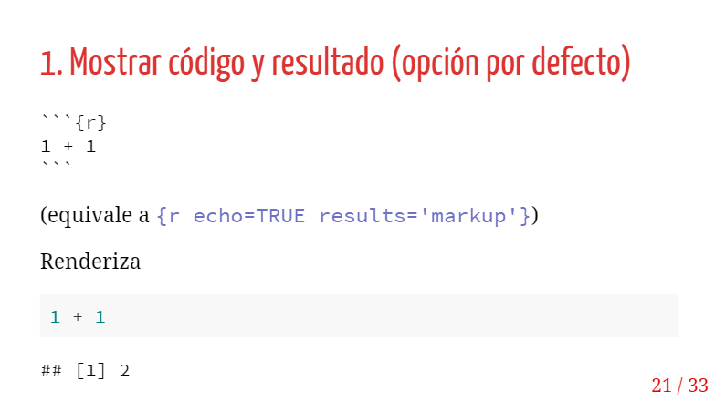

class: center, middle

# _Equipo de Tutores Sociología 2020_
- José Lopez
- Iván Ojeda
- Vanessa Leyton
- Javiera Wömpner
- Martín Venegas

```{r setup, include=FALSE,eval=TRUE}
options(htmltools.dir.version = FALSE)
```

```{r xaringan-themer, include=FALSE, warning=FALSE}
library(xaringanthemer)
style_duo(primary_color = "#1F4257", secondary_color = "#F97B64")

```
---
class: inverse, center, middle

# Estructura de presentación

- ¿Qué es Markdown?: Algunos ejemplos
- ¿Por qué usar Markdown?
- ¿Cómo usar Markdown?
- RMarkdown
---

.center[]

---
class: center, middle

# ¿Qué es Markdown?.md

Es un tipo de escritura digital en **texto plano**:

Forma de escribir que da formato al contenido en base a marcas de edición.
---
.pull-left[]
.pull-right[]
---
.pull-left[]
.pull-right[]
---
# ¿Por qué usar Markdown?

- Independiente a cualquier programa o plataforma en particular.

- Permite generar documentos dinámicos: combinar tanto texto como código.

- Se prioriza el contenido de lo escrito antes que el formato.

- Entre los distintos tipos de texto plano, Markdown es sencillo y permite todo lo necesario para documentos académicos.

- Documento base que puede ser transformado a distintas formatos de salida (html, pdf, word, etc.)

--
.center[]
---

---
### Abre un mundo de nuevas herramientas digitales:
- **RMarkdown**

- Protocolos de trabajo reproducible

- Xaringan

- Git/Github 

- Github pages

.center[https://martin-venegas-m.github.io/Open-Social-Sciences/]
---

# ¿Cómo usar Markdown?
Markdown se basa en marcas de edición simples y faciles de recordar. Algunas de las principales son:

* Para usar **negrita**: Dos asteriscos entre medio de una palabra, frase o parrafo, o dos guión bajo.

* Para usar *cursiva*: Un asterisco entre medio de una palabra, frase o parrafo, o un guion bajo.

* Para tachar ~~texto~~: Dos virgulillas entre medio de una palabra, frase o párrafo.

* Títulos se marcan con # al principio, subtítulos ## , y así sucesivamente. Por ejemplo:

---
.pull-left[
# Título 1
## Título 2
### Título 3
#### Título 4
##### Título 5
###### Título 6
]

.pull-right[
- ``` # Título 1 ``` 
- ``` ## Título 2 ``` 
- ``` ### Título 3 ``` 
- ``` #### Título 4 ``` 
- ``` ##### Título 5 ``` 
- ``` ###### Título 6 ``` 
]
---
# Algunas otras marcas de edición

- **Imagenes:**  ``` ```
- **Links:** ```[texto](link)```
- **Citas en bloque:** ``` > gran cita en bloque```
---
# Ejemplo de las marcas anteriores: Marx
.center[]

> Toda la historia de la sociedad humana, hasta la actualidad , es una **historia de luchas de clases**. Libres y esclavos, patricios y plebeyos, barones y siervos de la gleba, maestros y oficiales; en una palabra, opresores y oprimidos, frente a frente siempre, empeñados en una lucha ininterrumpida, velada unas veces, y otras franca y abierta, en una lucha que conduce en cada etapa a la transformación ~~revolucionaria~~ de todo el régimen social o al exterminio de ambas clases beligerantes

Para el *texto completo* ver [aquí](https://www.marxists.org/espanol/m-e/1840s/48-manif.htm) 
---
# ¿Dónde podemos utilizar Markdown?
El texto plano tiene por objetivo ser universal, y por ende Markdown también. Cualquier editor de texto sirve para escribir en Markdown (p.ej bloc de notas). Sin embargo, para poder visualizar las marcas de edición tenemos que utilizar un editor de texto que lea formato **.md**, o que pueda transformar nuestro Markdown a otro formato. Algunos ejemplos:

- Bear (Mac)
- Notion
- Atom
- Visual Studio
- Jupyter Notebook
- **RStudio**
---
# RMarkdown
RMarkdown es un tipo de formato que permite la elaboración de **documentos dinámicos** con distintas salidas posibles. Los documentos dinámicos son aquellos que **combinan texto y código** en el documento de origen, sin la necesidad de copiar y pegar. Las salidas de estos documentos pueden ser **html, pdf o worf**.

## Pros
- **Eficiencia:** flujo de trabajo más expedito
- **Reproducibilidad:** permite que los archivos sean facilmente reproducibles
- **Foco en el contenido:** focaliza la atención en la escritura más que en el diseño
- **Estética:** simple pero agradable. Tiene opción de personalización (p.ej a partir de CSS)
---
# Cómo crear un RMarkdown
Para generar documento RMarkdown: File > New File > R Markdown


---
# Elementos más básicos: YAML y Chunks

## YAML
El YAML (Yet Another Markdown Lenguage) es la configuración general de nuestro documento, en donde se pueden agregar cosas como: título, autores, fecha y especificaciones de diseño y estética.

## Chunks
A diferencia de las sintaxis (archivo.R) donde todo lo que escribimos es considerado como código, en RMarkdown (archivo.Rmd) todo lo que escribimos es considerado como lenguaje Markdown. Para escribir códigos tenemos que insertar **chunks** (trozos, pedazos) de código. Estos chunks tienen distintas especificaciones que influyen en el documento final.
---
# YAML
## Ejemplo:


- El YAML se escribe entre dos "tapas" de tres guiones cada una.
- En el output se especifica la salida del documento (pdf, html o word). Aquí se pueden introducir más elementos de estética. De hecho, RMarkdwon cuenta con algunas plantillas predeterminadas.
---
# Chunks
## Insertar


---
# Chunks
## Cómo se ve


- Un chunk de código está entre dos "tapas" de trios de comillas simples, con una {r} en la parte superior
- Podemos manipular las especificaciones del chunk de acuerdo a qué queremos mostrar (o no) en el documento final.
---
# Opciones (principales) de chunks
1. Mostrar código y resultado

2. Mostrar solo el código

3. Mostrar solo el resultado

4. No mostrar ni código ni resultado

5. Mostrar código sin ejecutarlo

6. Entregar resultado en formato directo (ej: html o latex)

- Estos cambios se pueden hacer tanto en los corchetes del chunk {r}, como en el botón de ajustes. Veamos ejemplos:
---
# Ejemplo por código en corchete

---
# Ejemplo por código en corchete

---
# Ejemplo por botón de ajustes

---
# ¿Cómo transformamos nuestro RMarkdown en otro formato?
Esto se da a travéz del **renderizado**, y especialmente con un paquete llamado *knitr*. Este paquete permite tejer las marcas de edición y el código elaborado en un documento final tipo html, pdf o word, dependiendo de lo que queramos.


---
# Algunos ejemplos: grafo
## Código


---
## Output

---
# Algunos ejemplos: CV


---
class: inverse, middle

# Síntesis

- Markdown es un lenguaje de escritura de texto plano de **pocas marcas de edición**.

- Markdown nos permite ser propietarios de lo que escribimos, poner el foco en el contenido y es la base para elaborar documentos académicos simples y estéticos.

- Markdown abre la puerta a una serie de herramientas digitales.

- RMarkdown nos permite crear documentos dinamicos (que combinan código y escritura)

- RMarkdown hace más eficaz el flujo de trabajo, permite la reproducibilidad y la personalización.
- RMarkdown permite elaborar otro tipo de documentos, como presentaciones y curriculums vitae.
---
# Recursos
- Esta presentación toma gran parte de su contenido del ramo Ciencia Social Abierta, elaborado por el profesor Juan Carlos Castillo. Para ver el material del ramo hacer click [aquí](https://cienciasocialabierta.netlify.app/).

- La estética de esta presentación fue elaborada por [Julio Iturra](https://github.com/jciturras).

- Un buen de tutorial para Markdown puede encontrarse [aquí](https://www.markdowntutorial.com/).

- Para ver un resumen de las distintas marcas de RMarkdown hacer click [aquí](https://rstudio.com/wp-content/uploads/2015/02/rmarkdown-cheatsheet.pdf)

- Para una guía completa de RMarkdown ver [aquí](https://bookdown.org/yihui/rmarkdown/)
---
class: inverse, center, middle
# ¡Muchas gracias!

